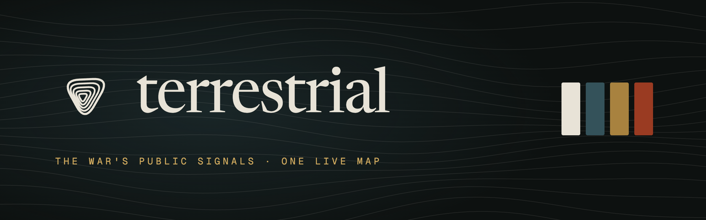
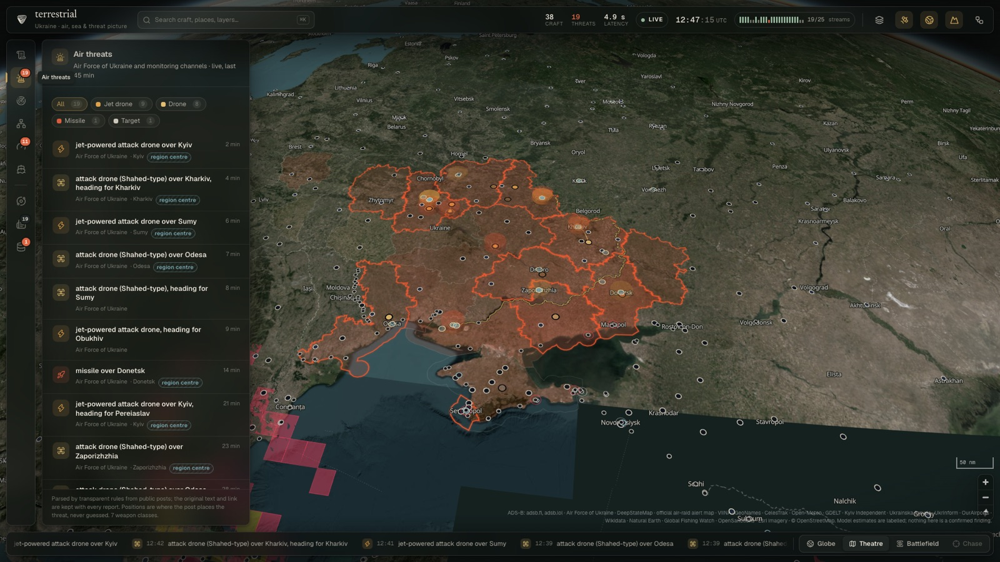
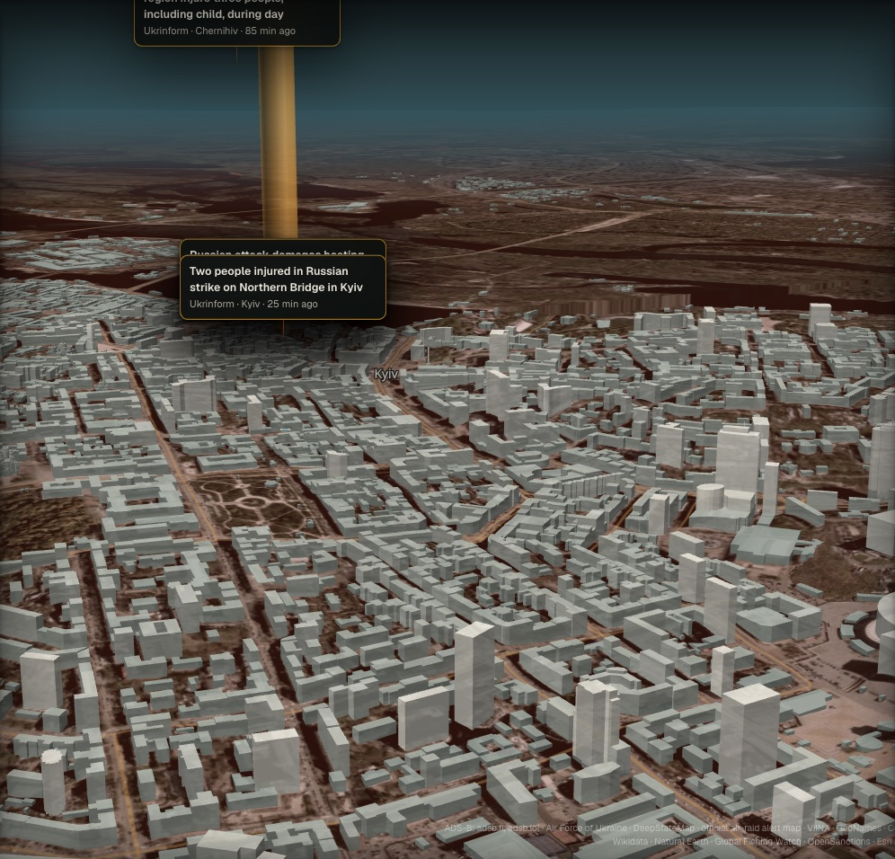
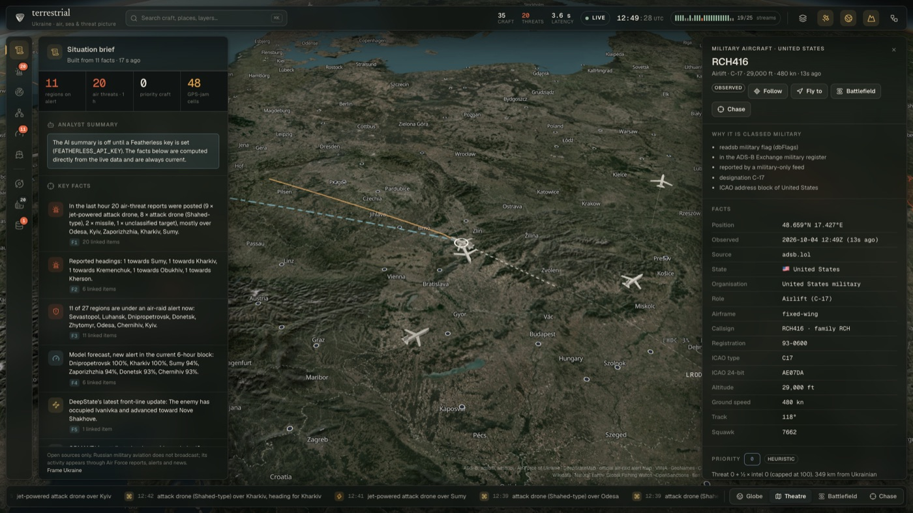
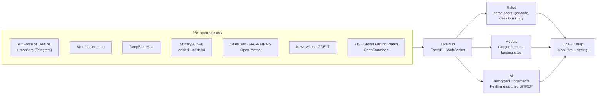

<p align="center">
  
</p>

<p align="center">
  <b>Every public signal of the war in Ukraine on one live map: what is coming, where, and how sure we are.</b>
</p>

<p align="center">
  <a href="https://terrestrial-azure.vercel.app"></a>
</p>

<p align="center">
  
  
  
  
</p>

<p align="center">
  <a href="https://terrestrial-azure.vercel.app"><b>Open the live map</b></a> ·
  <a href="#what-it-does">What it does</a> ·
  <a href="#how-it-works">How it works</a> ·
  <a href="#the-models">The models</a> ·
  <a href="#run-it">Run it</a> ·
  <a href="docs/pitch.md">Pitch notes</a>
</p>

<p align="center">
  
</p>

## Why

During an attack on Ukraine, everything you need to understand it is already public: the Air Force of Ukraine posts each drone and missile as it flies, the official alert map lights up region by region, DeepStateMap redraws the front, satellites pass overhead and news wires report the impacts.

But it comes in pieces, spread across a dozen apps and Telegram channels. Nobody draws the report on a map, ties it to the alert, says which region is next, or shows where each claim came from.

**Terrestrial does.** It reads more than 25 open streams continuously, fuses them into one 3D picture, forecasts what comes next with models that publish their own scorecards, and links every fact back to its source.

## What it does

<table>
  <tr>
    <td width="50%"></td>
    <td width="50%"></td>
  </tr>
  <tr>
    <td><b>Battlefield view.</b> Drop from the globe to street level over real terrain and OpenStreetMap buildings. Reported strikes get a light beam, lit buildings and a card with the source and its age.</td>
    <td><b>Where every military aircraft will land.</b> A ranked forecast of landing sites with probabilities and ETAs, re-routed live with winds aloft, drawn teal and dashed because it is an estimate.</td>
  </tr>
</table>

| | |
|---|---|
| **Air threats in flight** | The Air Force of Ukraine's channel and a long-running monitor are read every 30 s. Each post becomes a placed threat (jet drone, Shahed, cruise or ballistic missile, glide bombs) with its reported heading, the overnight tally of launch areas, and the original post one click away. Ukrainian place names are resolved through their inflections ("на Сумщині" → Sumy region). |
| **Danger forecast** | For every region, the chance of a new air-raid alert in the next 6 hours, from a model trained on every alert since 2022 plus reported attacks, weather and moon phase. Active alerts pulse on the map. |
| **Military air and sea picture** | Military aircraft and naval vessels only (civil traffic is dropped at ingest), each with why it is classed military, its state and role, full flight history, mission groups (tanker rendezvous, surveillance orbits, formations) and a transparent priority score. |
| **Front line** | DeepStateMap's occupied territory, the front line (≈1,100 km), attack directions, estimated Russian unit positions and the airfields Russia flies from. |
| **GPS jamming** | Interference cells derived from the position accuracy every aircraft reports, in the style of gpsjam.org. |
| **Space** | 80+ radar and optical imaging satellites propagated live, and the next time one can look at any place you click. |
| **Dark vessels** | The Black Sea shadow fleet: AIS gaps, the area each ship could have reached while dark, unmatched satellite-radar detections inside it, probable covert calls at occupied ports, sanctions matches and a day-by-day network in TuringDB. |
| **Situation brief** | The picture as numbered facts, always current. An open-weight LLM writes the SITREP and must cite those facts; a summary citing a fact that does not exist is rejected. |
| **Search and sources** | ⌘K finds any aircraft, report, town, layer or command. The Data streams panel shows every source, its licence and whether it is healthy right now. |

## How it works



1. **Read.** Async pollers pull every stream every 1–30 seconds into a single hub. Civil traffic is dropped at ingest.
2. **Fuse and forecast.** Transparent rules turn posts into placed threats, trained models forecast danger and destinations, and Jev labels news events and missions with a probability attached.
3. **Show it honestly.** One visual grammar everywhere: observed facts are bone and solid; model estimates are teal and dashed; threats are rust; the front line is ochre. Nothing is ever labelled "confirmed".

**Jev (TypeSafe)** answers typed questions in under half a second: for each headline, what kind of event, what was hit, which region, whether it was a Russian strike (yes/no with probability) and how severe; for each group of aircraft, which mission. Code computes every number; Jev only judges, and every answer is stored with its probability and model version.

**Featherless** writes the situation summary from numbered facts and must cite them.

## The models

Trained on 2022–2025, calibrated on late 2025, and tested only on 2026: never random splits. Each ships a model card that the app shows verbatim, including whether it beats simple baselines.

| Model | What it predicts | Test result (2026) | Best simple baseline |
|---|---|---|---|
| **Danger forecast** | New air-raid alert per region in the next 6 h | ROC-AUC **0.86**, Brier **0.150** | Persistence 0.185 (**19% better**), climatology 0.199 (**25% better**) |
| **Landing site** | Where a military aircraft will land | **69%** first guess, **81%** in top 3 | 53% |

Models publish to Hugging Face with their cards (`make publish`), and the next model, a town-level strike forecast, trains on Kaggle GPUs.

## What it deliberately does not do

- **Russian military aircraft do not broadcast**, so no public tracker can see them. Their activity enters through the Air Force's reports, alerts and news, which is exactly what Terrestrial reads. Over five days we saw 40–60 military aircraft a day near Ukraine, nearly all NATO airlift, tankers and surveillance.
- Headings are where a threat was **reported** going, never a predicted impact point.
- Submarines are never plotted, only their bases. Fuel is never observed; endurance is a type-level estimate.
- Everything shown is already public. Terrestrial adds no new collection.

## Built with

**Data**
<br/>


**AI and models**
<br/>


**Platform**
<br/>


| Layer | Choice | Why |
|---|---|---|
| Ingest and API | Python 3.11, FastAPI, httpx, WebSocket | One language for data, models and server; async polling of every stream on a laptop |
| Models | scikit-learn gradient boosting, isotonic calibration | Small tabular models with probabilities you can trust; no GPU needed to serve |
| Geo | shapely, pyproj, SGP4, GeoNames | Exact front-line geometry, reachability and satellite passes |
| Map | MapLibre globe and terrain, deck.gl | Open source, no tokens, thousands of moving objects at 30 fps |
| App | React, TypeScript, Vite | Typed end to end, fast to build |
| Graph | TuringDB | Versioned dark-vessel network with one commit per day |

## Run it

The quickest look is the **[live demo](https://terrestrial-azure.vercel.app)**. It replays a real capture of the live system in your browser, labelled with its capture time.

To run it live (Python 3.11 with [uv](https://docs.astral.sh/uv/), Node 20+):

```bash
cp .env.example .env     # add any keys you have; 19 streams need none
make setup               # uv sync + npm install
make live                # live server on :8001
make web                 # the app on http://localhost:5173
```

<details>
<summary><b>API keys</b> (optional, each unlocks more)</summary>

Put them in `.env` (never in git) and restart `make live`.

| Key | Unlocks | Get it |
|---|---|---|
| `TYPESAFE_API_KEY` | Jev: news → structured events, mission labels | docs.typesafe.ai |
| `FEATHERLESS_API_KEY` | AI SITREPs and vessel briefs | featherless.ai |
| `GFW_API_TOKEN` | Dark vessels (Global Fishing Watch) | globalfishingwatch.org/our-apis/tokens |
| `AISSTREAM_API_KEY` | Live naval AIS | aisstream.io |
| `FIRMS_MAP_KEY` | Thermal anomalies (strikes, fires) | firms.modaps.eosdis.nasa.gov |
| `KAGGLE_USERNAME`, `KAGGLE_KEY` | Training data and GPU notebooks | kaggle.com → Settings → Create New Token |
| `HF_TOKEN` | `make publish`: models to Hugging Face | huggingface.co/settings/tokens (write) |

</details>

<details>
<summary><b>Train, publish, deploy, demo offline</b></summary>

```bash
make history                                   # 2022 → now: alerts, VIINA, weather
uv run python -m predict.strike.train          # danger models
uv run python -m history.adsb_archive --days 7 # archived military flights
uv run python -m predict.flight.train          # landing model (the live server hot-reloads it)
make publish                                   # models + cards to Hugging Face (private; --public to share)

make capture MIN=12                            # record the live server for the hosted build
make deploy                                    # build and deploy the hosted replay to Vercel

make demo-cut DAY=20261003 && make demo        # replay a recorded day with no network
make test                                      # 128 tests on real saved responses
```

</details>

## Repository

```
live/       live server: sources, hub, military classifier, nets, threat, GNSS, satellites, Telegram, SITREP, AI
predict/    trained models: strike (danger forecast), flight (landing sites), Hugging Face publishing
history/    historical data lake: alerts, VIINA, weather, DeepState, adsb.lol archive
reference/  airfields, aircraft register, ICAO ranges, gazetteer, land mask
pipeline/   dark vessels: fetch → normalise → envelope → match → score → insights → brief
graph/ api/ dark-vessel graph (TuringDB) and API
web/        the app: React + TypeScript, MapLibre + deck.gl
tests/      pytest on real saved responses (tests/fixtures/README.md lists every source)
docs/       pitch notes and assets
CLAUDE.md   the build spec and every decision since
```

## Brand


The mark is nested rounded triangles drawn as topographic contours. The wordmark is lower-case Newsreader; the interface is Geist and Geist Mono. The palette is ink `#0D1110`, bone `#E8E3D7`, slate teal `#34525A`, ochre `#A8823F` and rust `#9A3B22`. The same colours carry meaning in the product: bone is observed, teal is an estimate, rust is a threat, ochre is the front.

<br clear="left" />

## Data and licence

Air: adsb.fi and adsb.lol (ODbL), ADS-B Exchange aircraft database, the adsb.lol `globe_history` archive. Threats: Air Force of Ukraine and war_monitor public Telegram posts, the official air-raid alert map, DeepStateMap.Live. History: Vadimkin air-raid sirens dataset, VIINA 2.0. Space: CelesTrak. News: Kyiv Independent, Ukrainska Pravda, Ukrinform, GDELT. Reference: OurAirports, GeoNames (CC BY 4.0), Wikidata, Natural Earth, geoBoundaries. Weather: Open-Meteo (CC BY 4.0). Maritime: Global Fishing Watch and OpenSanctions (non-commercial, attribution). Imagery: Esri. Maps: © OpenStreetMap contributors.

Code is [MIT](LICENSE). Data stays under its providers' licences, credited in the app.

<p align="center"><sub>Built for the European Defence Tech Hackathon, London, October 2026. Слава Україні.</sub></p>
